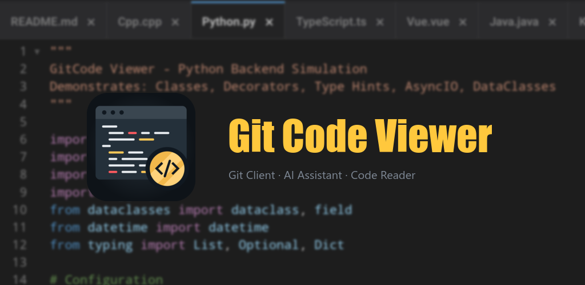

# Git 코드 뷰어

[English](./README.md) | [简体中文](./README_ZH.md) | [Deutsch](./README_DE.md) | [Español](./README_ES.md) | [Français](./README_FR.md) | [हिन्दी](./README_HI.md) | [日本語](./README_JA.md) | 한국어 | [Português (Brasil)](./README_PT_BR.md) | [Bahasa Indonesia](./README_ID.md) | [Türkçe](./README_TR.md)

&nbsp;&nbsp;

GitCode Viewer는 컴퓨터에서 누리던 Git 작업과 코드 읽기 경험을 휴대폰과 태블릿으로 가져옵니다. 어디서든 코드와 문서를 읽으세요.

내 저장소가 곧 지식 베이스입니다. 내장 AI 어시스턴트가 저장소 탐색, 버그 찾기, 코드 설명, 문서 요약, 커밋 로그 조회, 번역 등을 도와줍니다.

## 주요 기능

- 🤖 **똑똑함:** 주요 및 사용자 지정 AI 모델 제공업체 지원, OpenAI·Anthropic 형식 API 호환.
- 🌿 **매끄러움:** Clone / Branch / Log / Diff, 컴퓨터와 다름없는 사용감.
- 🎨 **코드:** 30여 개 언어(Java / Python / JavaScript 등) 구문 강조, 코드 개요와 심볼 이동 지원.
- 📚 **문서:** Markdown / Mermaid / Jupyter / Office / PDF를 바로 열람.
- 🔎 **둘러보기:** GitHub 트렌드와 검색 내장, 인기 프로젝트를 빠르게 탐색.
- 📁 **관리:** GitHub / GitLab / Bitbucket 등 및 자체 호스팅 비공개 저장소 지원, SSH / PAT로 안전하게 접속.
- 🧩 **간편함:** 오프라인 열람, 광고 없음, 바로 시작.

## 🚀 라이브 데모

📱 **앱에서 보고 계신가요?** 아래 파일을 탭하여 구문 강조 및 렌더링 기능을 즉시 미리 보세요.

> **이 저장소를 가져오는 방법은 무엇인가요?**
> 앱에서 `GitCodeViewer`를 검색하거나, **+** -> **복제(Clone)**를 탭하고 다음을 입력하세요:
> `https://github.com/ada87/GitCodeViewer.git`

## 인기

- [Python](./backend/repo.py) | [Rust](./backend/sync.rs) | [TypeScript](./frontend/repo.ts) | [Golang](./backend/cache.go) | [Markdown](./document/markdown-code.md) | [Jupyter](./document/jupyter.ipynb)

## 코드

- frontend: [alias.mjs](./frontend/alias.mjs) | [board.htm](./frontend/board.htm) | [card.sass](./frontend/card.sass) | [page.html](./frontend/page.html) | [help.xhtml](./document/help.xhtml) | [panel.jsx](./frontend/panel.jsx) | [panel.less](./frontend/panel.less) | [preview.js](./frontend/preview.js) | [repo.ts](./frontend/repo.ts) | [resolver.mts](./frontend/resolver.mts) | [shell.astro](./frontend/shell.astro) | [state.cljs](./frontend/state.cljs) | [theme.scss](./frontend/theme.scss) | [tokens.css](./frontend/tokens.css) | [tree.tsx](./frontend/tree.tsx) | [viewer.vue](./frontend/viewer.vue)
- backend: [api.http](./backend/api.http) | [api.java](./backend/api.java) | [cache.go](./backend/cache.go) | [data.edn](./backend/data.edn) | [fetch.rb](./backend/fetch.rb) | [graph.sparql](./backend/graph.sparql) | [jobs.kt](./backend/jobs.kt) | [legacy.php5](./backend/legacy.php5) | [mail.php](./backend/mail.php) | [node.cts](./backend/node.cts) | [query.rq](./backend/query.rq) | [query.sql](./backend/query.sql) | [repo.clj](./backend/repo.clj) | [repo.py](./backend/repo.py) | [report.r](./backend/report.r) | [rules.scala](./backend/rules.scala) | [scan.cjs](./backend/scan.cjs) | [schema.ddl](./backend/schema.ddl) | [script.csx](./backend/script.csx) | [seed.dml](./backend/seed.dml) | [shared.cljc](./backend/shared.cljc) | [stats.jl](./backend/stats.jl) | [store.cs](./backend/store.cs) | [sync.rest](./backend/sync.rest) | [sync.rs](./backend/sync.rs) | [types.pyi](./backend/types.pyi)
- system: [cache.cc](./system/cache.cc) | [core.c](./system/core.c) | [core.h](./system/core.h) | [core.wat](./system/core.wat) | [engine.cpp](./system/engine.cpp) | [index.hpp](./system/index.hpp) | [login.bash](./system/login.bash) | [main.c++](./system/main.c++) | [path.h++](./system/path.h++) | [path.inl](./system/path.inl) | [profile.zsh](./system/profile.zsh) | [render.hxx](./system/render.hxx) | [report.cxx](./system/report.cxx) | [ring.ipp](./system/ring.ipp) | [scan.hh](./system/scan.hh) | [shell.ps1](./system/shell.ps1) | [shell.sh](./system/shell.sh) | [stats.tcc](./system/stats.tcc) | [sync.psm1](./system/sync.psm1) | [telemetry.jsm](./system/telemetry.jsm) | [text.wast](./system/text.wast)
- mobile: [bridge.mm](./mobile/bridge.mm) | [panel.m](./mobile/panel.m) | [reader.ets](./mobile/reader.ets) | [repos.dart](./mobile/repos.dart) | [sync.swift](./mobile/sync.swift)
- template: [guide.njk](./template/guide.njk) | [mail.jinja2](./template/mail.jinja2) | [page.jinja](./template/page.jinja) | [panel.j2](./template/panel.j2) | [panel.phtml](./template/panel.phtml) | [theme.liquid](./template/theme.liquid)
- config: [app.json](./config/app.json) | [app.plist](./config/app.plist) | [app.yaml](./config/app.yaml) | [build.kts](./config/build.kts) | [build.targets](./config/build.targets) | [build.yml](./config/build.yml) | [cargo.toml](./config/cargo.toml) | [data.xml](./config/data.xml) | [editor.jsonc](./config/editor.jsonc) | [module.psd1](./config/module.psd1) | [pack.props](./config/pack.props) | [report.xslt](./config/report.xslt) | [schema.xsd](./config/schema.xsd) | [service.wsdl](./config/service.wsdl) | [style.xsl](./config/style.xsl) | [theme.json5](./config/theme.json5) | [tool.csproj](./config/tool.csproj)

## 문서

- office: [sample-1.docx](./office/sample-1.docx) | [sample-2.xlsx](./office/sample-2.xlsx) | [sample-3.pptx](./office/sample-3.pptx) | [sample-4.pdf](./office/sample-4.pdf) | [sample-5.tsv](./office/sample-5.tsv) | [sample-6.xlsm](./office/sample-6.xlsm) | [sample-7.xlsb](./office/sample-7.xlsb) | [sample-8.csv](./office/sample-8.csv) | [sample-9.rtf](./office/sample-9.rtf)
- document: [markdown-basic.md](./document/markdown-basic.md) | [markdown-code.md](./document/markdown-code.md) | [guide.markdown](./document/guide.markdown) | [draft.mdx](./document/draft.mdx) | [audit.ipynb](./document/audit.ipynb) | [jupyter.ipynb](./document/jupyter.ipynb)
- diagram: [architecture.mmd](./diagram/architecture.mmd) | [classdiagram.mmd](./diagram/classdiagram.mmd) | [complex-architecture.mmd](./diagram/complex-architecture.mmd) | [erdiagram.mmd](./diagram/erdiagram.mmd) | [flow.mermaid](./diagram/flow.mermaid) | [flowchart.mmd](./diagram/flowchart.mmd) | [gantt.mmd](./diagram/gantt.mmd) | [gitgraph.mmd](./diagram/gitgraph.mmd) | [mindmap.mmd](./diagram/mindmap.mmd) | [pie.mmd](./diagram/pie.mmd) | [sequence.mermaid](./diagram/sequence.mermaid) | [timeline.mmd](./diagram/timeline.mmd) | [trace.mmd](./diagram/trace.mmd) | [xychart.mmd](./diagram/xychart.mmd)
