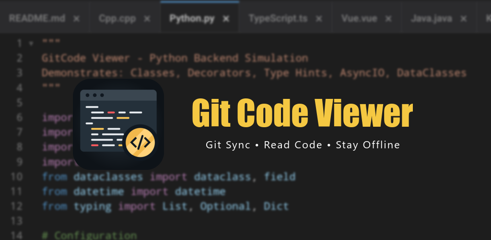

# Git代码阅读器 (GitCode Viewer)

[English](./README.md) | 简体中文 | [Deutsch](./README_DE.md) | [Español](./README_ES.md) | [Français](./README_FR.md) | [हिन्दी](./README_HI.md) | [日本語](./README_JA.md) | [한국어](./README_KO.md) | [Português (Brasil)](./README_PT_BR.md)

一款高性能源码阅读工具，助您随时随地查看代码。

## 功能特性

1. **离线Git：** 克隆之后离线查看，支持 branch、log 等 Git 操作，支持私有仓库。
2. **语言高亮：** 支持几乎所有主流编程语言（HTML、JS、CSS、Python、TypeScript、Java、C++、PHP、Rust、Go、Ruby、Kotlin、Dart、Bash、SQL、YAML 等）。
3. **文档阅读：** 支持 Markdown、Mermaid（.mmd、.mermaid）、Jupyter（.ipynb）等文档。
4. **皮肤样式：** 支持明/暗皮肤，支持 VS Code/JetBrains 皮肤样式。
5. **GitHub：** 快速发现并下载热门公开项目。

## 🚀 在线演示

📱 **正在 App 中查看？** 点击下方文件即可即时预览语法高亮和渲染能力。

> **如何获取此仓库？**
> 在 App 中搜索Github `GitCodeViewer`，或 **克隆** https://github.com/ada87/GitCodeViewer.git

## 代码样例

* 最受欢迎: [Python](./code/Python.py) | [TypeScript](./code/TypeScript.ts) | [Rust](./code/Rust.rs) | [Golang](./code/Golang.go) | [C](./code/C.c)
* 其它语言: [Java](./code/Java.java) | [C++](./code/Cpp.cpp) | [C#](./code/CSharp.cs) | [Kotlin](./code/Kotlin.kt) | [Scala](./code/Scala.scala) | [Swift](./code/Swift.swift) | [Dart](./code/Dart.dart) | [Ruby](./code/Ruby.rb) | [PHP](./code/PHP.php)
* 前端: [HTML](./code/HTML.html) | [JavaScript](./code/JavaScript.js) | [CSS](./code/CSS.css) | [SCSS](./code/Sass.scss) | [Less](./code/Less.less) | [Vue](./code/Vue.vue) | [JSX](./code/JSX.jsx) | [TSX](./code/TSX.tsx) | [Astro](./code/Astro.astro)
* 模板引擎: [Jinja](./code/Jinja.jinja) | [Liquid](./code/Liquid.liquid)
* 脚本与数据: [Shell](./code/Shell.sh) | [PowerShell](./code/PowerShell.ps1) | [SQL](./code/SQL.sql) | [JSON](./code/JSON.json) | [XML](./code/XML.xml) | [YAML](./code/YAML.yaml) | [WebAssembly](./code/WebAssembly.wat)
* Markdown: [Basic](./code-rich/Markdown-Basic.md) | [Code](./code-rich/Markdown-Code.md)
* Mermaid: [流程图](./code-rich/FlowChart.mmd) | [时序图](./code-rich/Sequence.mermaid) | [类图](./code-rich/ClassDiagram.mmd) | [ER图](./code-rich/ERDiagram.mmd) | [架构图](./code-rich/Architecture.mmd) | [复杂架构](./code-rich/Complex-Architecture.mmd) | [甘特图](./code-rich/Gantt.mmd) | [Git图](./code-rich/GitGraph.mmd) | [思维导图](./code-rich/Mindmap.mmd) | [饼图](./code-rich/Pie.mmd) | [时间线](./code-rich/Timeline.mmd) | [XY图表](./code-rich/XYChart.mmd)
* Jupyter: [Notebook](./code-rich/Jupyter.ipynb)

