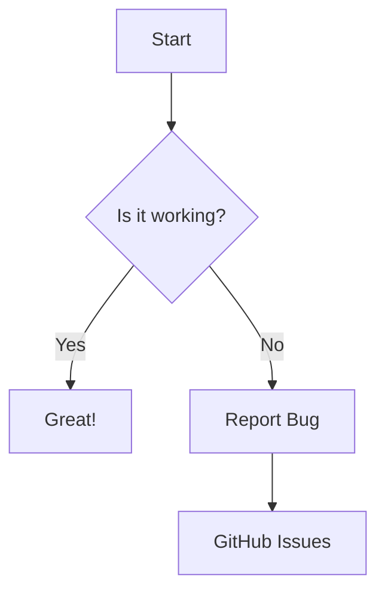

# Markdown All-In-One Test

This file demonstrates the rendering capabilities of **Code Viewer**.

## 1. Text Formatting
**Bold Text**, *Italic Text*, ~~Strikethrough~~, `Inline Code`.

> **Note**: This is a blockquote.
>
> It can span multiple lines.

## 2. Lists
- [x] Task 1 (Done)
- [ ] Task 2 (Todo)
- [ ] Task 3
  - Nested Item A
  - Nested Item B

1. Ordered List 1
2. Ordered List 2
3. Ordered List 3

## 3. Tables

| Feature | Support | Rating |
| :--- | :---: | ---: |
| Syntax Highlighting | ✅ | 5/5 |
| Offline Access | ✅ | 5/5 |
| Diagrams | ✅ | 4/5 |

## 4. Code Blocks

```typescript
// TypeScript Example
interface User {
  id: number;
  name: string;
}

const getUser = (id: number): User => {
  return { id, name: "Code Viewer" };
};
```

## 5. Math (LaTeX)
If your viewer supports MathJax/KaTeX:

$$
f(x) = \int_{-\infty}^\infty \hat f(\xi)\,e^{2\pi i \xi x} \,d\xi
$$

Inline math: $E = mc^2$

## 6. Embedded Mermaid Diagrams
You can view diagrams directly inside Markdown files.



## 7. Links & Images
[Visit our GitHub Repo](https://github.com/ada87/GitCodeViewer)


