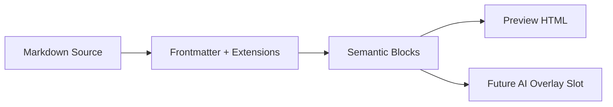

# Markdown All Features

This file is the broad regression sample for the new markdown reader.
Use it to verify typography, hierarchy, block spacing, media layout, TOC behavior, copy affordances, and repo-aware links in one pass.

## Quick Navigation

- [Jump to callouts](#callouts)
- [Jump to media blocks](#media-blocks)
- [Jump to code fence meta](#code-fence-meta)
- [Jump to repeated heading](#repeated-heading)

Standard links:

- [Repo README](../README.md)
- [Basic markdown sample](./markdown-basic.md)
- [Code showcase](./markdown-code.md)
- [MDX sample](./draft.mdx)

Wiki links:

- [[../README|Repo README via wiki]]
- [[./markdown-basic|Basic sample via wiki]]
- [[./markdown-code.md|Code sample via wiki]]
- [[#media-blocks|Jump to media section]]

![[../README.md|Repo README document card]]

## Reading Rhythm

Markdown preview should stay readable when a document keeps changing shape: paragraph, table, quote, task list, code, image, then back to prose.

Inline styles should stay calm: **bold**, *italic*, ~~strikethrough~~, and `inline code`.

> This is a normal blockquote.
> It should feel distinct from callouts and keep comfortable contrast.

<details>
<summary>Expandable HTML block</summary>
This checks that lightweight inline HTML still renders after sanitization.
</details>

## Callouts

> [!note] Note Callout
> Good reader chrome should make semantic emphasis obvious without breaking the flow.

> [!tip] Tip Callout
> Keep block-level structure stable so future AI overlays can target semantic blocks instead of transient DOM positions.

> [!warning] Warning Callout
> Test callout spacing in both light and dark themes.

> [!danger] Danger Callout
> Dense documents become hard to trust if strong warning content is visually flattened.

## Task Lists

- [x] Task list items render with disabled checkboxes
- [x] Nested tasks keep alignment
- [ ] Future AI actions are intentionally not wired yet
  - [x] Extension points stay reserved
  - [ ] No overlay UI in this build

## Tables And Footnotes

| Surface | What to inspect | Expected outcome |
| --- | --- | --- |
| Headings | hierarchy and anchor affordance | clear resets and stable anchor copy affordance |
| TOC | active state and max depth | quick navigation without visual noise |
| Media | caption and alignment parsing | clean float/wide behavior |
| Code | toolbar, wrap, copy, collapse | practical reader controls |
| Footnotes | reference and back-link styling | readable long-form annotation flow |

Reader polish should favor stable semantics over DOM tricks.[^semantics]
Lightbox and media captions should feel like preview affordances, not blog chrome.[^media]

## Math

Inline math should work inside prose: $E = mc^2$, $a^2 + b^2 = c^2$, and $\int_0^1 x^2 dx = \frac{1}{3}$.

$$
latency\_budget = dns + tls + api + render
$$

$$
\text{readerScore} = 0.35 \cdot \text{hierarchy} + 0.30 \cdot \text{spacing} + 0.20 \cdot \text{contrast} + 0.15 \cdot \text{affordance}
$$

## Media Blocks


This paragraph should sit below a wide image block and recover into the standard reading width afterward.


This paragraph should flow beside a left-aligned local media block on wider layouts.

[](../README.md)

This paragraph checks that a linked standalone image is upgraded into a media figure and still opens its link when tapped.


![[../other/feature-graphic.png|Embedded wiki image | align=wide]]

## Code Fence Meta

The next fences check explicit languages, file metadata, line highlighting, wrapping, collapsing, and plain-fence auto detection.

```ts title="src/reader/render.ts" {2,4-6} wrap collapse
export function buildReaderTitle(name: string) {
  const normalized = name.trim();
  if (!normalized) return "Untitled";
  const suffix = normalized.length > 24 ? "preview" : "doc";
  return `${normalized} · ${suffix}`;
}
```

```json filename="config/markdown.json"
{
  "tocPosition": "float",
  "tocMaxLevel": 3,
  "codeLineNumbers": true,
  "readerWidth": "comfortable"
}
```

```sql file="sql/fetch_recent_docs.sql" {1,3}
SELECT id, title, updated_at
FROM documents
WHERE is_archived = 0
ORDER BY updated_at DESC;
```

```
export async function openDocument(docId) {
  const response = await fetch(`/documents/${docId}`);
  if (!response.ok) throw new Error("load failed");
  return response.json();
}
```



## Repeated Heading

This section exists to verify anchor generation on repeated slugs.

### Repeated Heading

The first repeated heading should get the base slug.

### Repeated Heading

The second repeated heading should get a deduplicated slug.

## Embeds And Attachments

![[../other/sample-3.pdf|Sample PDF attachment]]

![[../README.md#features|README anchor card]]

## Horizontal Rule

---

## Final Checklist

1. Toggle theme and confirm code, callouts, and tables remain readable.
2. Toggle line numbers and confirm highlighted rows stay visually distinct.
3. Click a heading anchor and verify the copied hash looks correct.
4. Open the wiki links and standard links to verify relative path resolution.
5. Tap images to confirm the lightbox opens with the parsed caption.

[^semantics]: Stable block structure matters because later translation or extraction features should attach to semantic blocks, not pixel coordinates.
[^media]: Markdown readers usually contain mixed asset types, so local and remote image handling needs to feel consistent.
