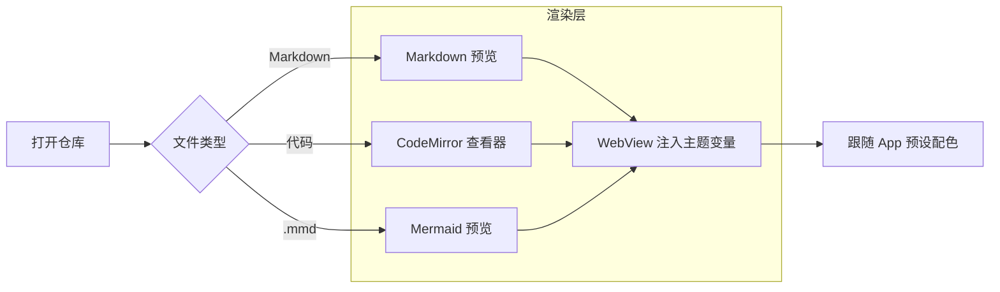
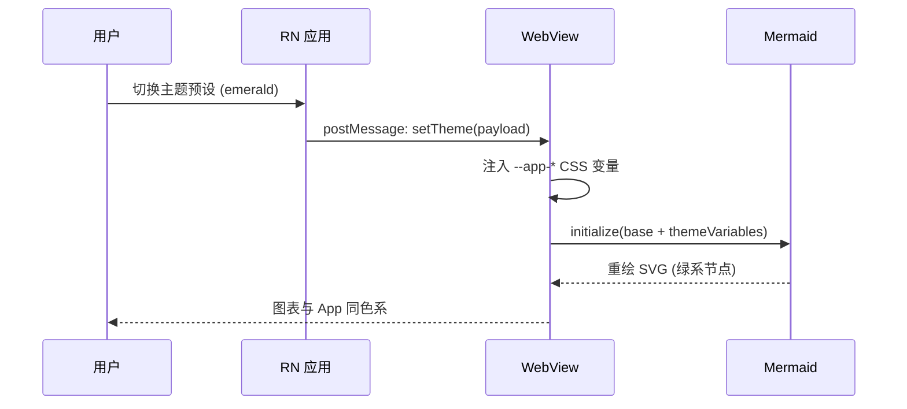

# Markdown Code Showcase

This document focuses on fenced code blocks because that is where the Markdown viewer carries the most UI responsibility.
Open it once with code line numbers disabled and once with them enabled.

## What to look for

1. The language label should match the fence language.
2. Copy buttons should stay aligned even on long blocks.
3. Line wrapping should remain readable when enabled.
4. Syntax colors should still preserve contrast in dark and light themes.

## TypeScript

```ts
interface RepoSummary {
  fullName: string
  branch: string
  stars: number
  language: string | null
}

export function pickFeatured(repos: RepoSummary[]) {
  return repos
    .filter((repo) => repo.stars >= 500)
    .sort((left, right) => right.stars - left.stars)
    .slice(0, 6)
}
```

## JSON

```json
{
  "viewer": {
    "theme": "vscode-dark",
    "markdownTocPosition": "float",
    "markdownCodeLineNumbers": false,
    "lineWrap": true
  },
  "repo": {
    "name": "GitCodeViewer",
    "autoOpenReadme": true
  }
}
```

## Bash

```bash
pnpm install
pnpm exec tsc --noEmit
pnpm --dir web exec tsc --noEmit
pnpm -s web:build
```

## YAML

```yaml
steps:
  - name: install
    run: pnpm install
  - name: typecheck
    run: pnpm --dir web exec tsc --noEmit
  - name: build-assets
    run: pnpm -s web:build
```

## SQL

```sql
SELECT language, COUNT(*) AS files, MAX(updated_at) AS last_seen
FROM repo_files
WHERE repo_id = :repo_id
GROUP BY language
ORDER BY files DESC, language ASC;
```

## Diff

```diff
- const sampleRoot = '/code-rich'
+ const sampleRoot = '/document'

- const autoOpen = 'README.md'
+ const autoOpen = ['README.md', 'README.mdx', 'README.markdown']
```

## XML

```xml
<viewer>
  <markdown toc="float" lineNumbers="false" />
  <mermaid zoom="dev-only" pan="dev-only" />
  <notebook outputs="stream,html,error" />
</viewer>
```

## Rust

```rust
pub fn format_bytes(bytes: u64) -> String {
    match bytes {
        b if b < 1024 => format!("{} B", b),
        b if b < 1024 * 1024 => format!("{} KB", b / 1024),
        b => format!("{:.1} MB", b as f64 / (1024.0 * 1024.0)),
    }
}
```

## Why this matters

Markdown is often where users first judge the product.
If code fences look cramped, misaligned, or low-contrast, the viewer feels unfinished even when the parser is technically correct.

---

## Mermaid Demo 1: Flowchart (with subgraph)



## Mermaid Demo 2: Sequence Diagram


